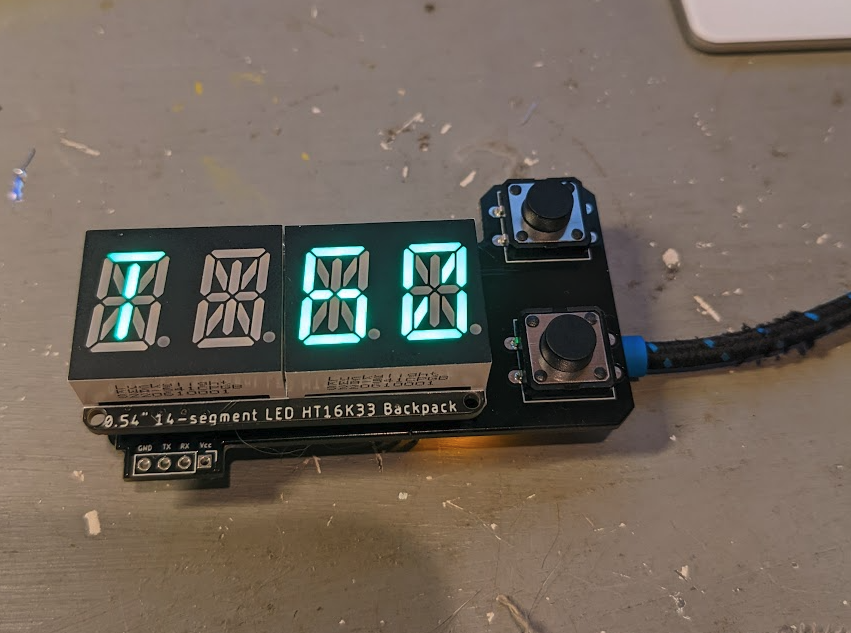

# EBIKE SPEEDOMETER PCB FEATURES
* Super boring 14 segment LED displays
* Adafruit HUZZAH32 ESP32 Feather
* Serial data --> board --> BLE to smartphone
* Compatible with [MESC controller](https://github.com/davidmolony/MESC_Firmware)

## Operation
Device connects to an ESC (e.g. the [MP2](https://github.com/badgineer/CCC_ESC) and receives data via a serial output. Data is in the form of json. Typcial data stream could include:
```
{"amps": 10, "volts": 20, "rpm": 200, "temp": 90}
```
The speeddometer is expecting certain tags and ignores others. For amps, volts, rpm and temp, these values as ints will be displayed on the 14 segment LED. RPM will be converted to MPH prior to display. 

Regardless of the values or data structure received, the entired data stream is passed on to a bluetooth device which can be captured on your smartphone using an app like [Serial Bluetooth Terminal](https://play.google.com/store/apps/details?id=de.kai_morich.serial_bluetooth_terminal). 

## Programming
* use the [STM32CubeIDE](https://www.st.com/en/development-tools/stm32cubeide.html) to progam the microcontroller on the ESC
* use [platformio](https://platformio.org/) for the ESP32. note, for reasons that are unclear, be sure to hold down the pushbutton on A11 pin of the ESP32 feather to initiate programming. This is annoying but simply disconnecting the pushbutton connection didnt work either. 


