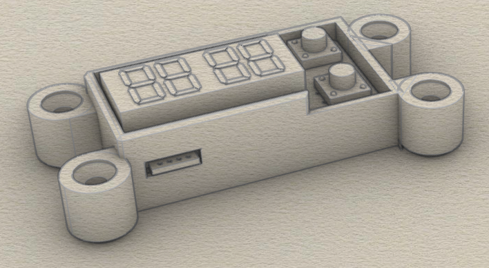
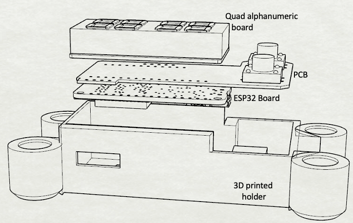

# EBIKE SPEEDOMETER FEATURES
* Completely uninteresting 14 segment LED displays
* Serial data --> board --> BLE to smartphone
* Compatible with [MESC controller](https://github.com/davidmolony/MESC_Firmware)



## Operation
Device connects to an ESC (e.g. the [MP2](https://github.com/badgineer/CCC_ESC) with a [F405 pill](https://github.com/davidmolony/F405_pill)) and receives json data via a serial output. Typcial data stream could include:
```
{"amps": 10, "volts": 20, "rpm": 200, "temp": 90}
```
But you can configure the F405 to send other values, but the speedometer is expecting the above tags and ignores others. The speedometer uses these values as ints that will be displayed on the 14 segment LED. RPM will be converted to MPH prior to display. 

Regardless of the values or data structure received, the entired data stream is passed on to a bluetooth device which can be captured on your smartphone using an app like [Serial Bluetooth Terminal](https://play.google.com/store/apps/details?id=de.kai_morich.serial_bluetooth_terminal). 

## Programming
* Use the [STM32CubeIDE](https://www.st.com/en/development-tools/stm32cubeide.html) to progam the microcontroller on the ESC
* Use [platformio](https://platformio.org/) for the ESP32. 

## ESP32 quirks
There are conflicts between bootstrapping capability and usage of some pins. If you notice your board wont program unless you keep the button depressed, it might be due to this conflict.

This reqiures that you burn the flash voltage selection eFuses change the internal regulator’s output voltage to 3.3 V. This was fixed with using a tool from [espressif](https://docs.espressif.com/projects/esptool/en/latest/esp32s3/espefuse/index.html): 

```
$ espefuse.py set_flash_voltage 3.3V --port /dev/cu.usbserial-01562A86
```
be sure to use the appropriate port name. 

## Speedometer operation
* Assemble PCB
* Set the following parameters in ESP32 code:
```
#define POLEPAIRS    5
#define CIRCUMFERENCE 78.5
```
(where circumference is cm of your back tire)

(code does not deal with gear ratios)
* Upload code to ESP32 using platformio
* Press top button to change LED display
* Display shows: "M", "A", "V" "T" for MPH, amps, battery voltage, and temperature
* Find "ESP32 Speedometer" on your smartphone
* Gather data using an app like [Serial Bluetooth Terminal](https://play.google.com/store/apps/details?id=de.kai_morich.serial_bluetooth_terminal)
* Note on the json data there's a mS value, press lower button to reset to zero

## BOM
* Adafruit Quad Alphanumeric Display w/ backpack
* Adafruit HUZZAH32 – ESP32 Feather Board
* PCB (gerbers are [here](https://github.com/owhite/ebike_speedo/tree/main/V1.1/gerbers))
* Two 10k 0805 resistors
* [TS14-1212-70-BK-160-SCR-D](https://www.cuidevices.com/product/resource/ts14.pdf) tactile switches
* This [housing](https://github.com/owhite/ebike_speedo/blob/main/3D_model/speedo_housing.stl) might be useful

Let's play: how tall is your stack of boards!? 

